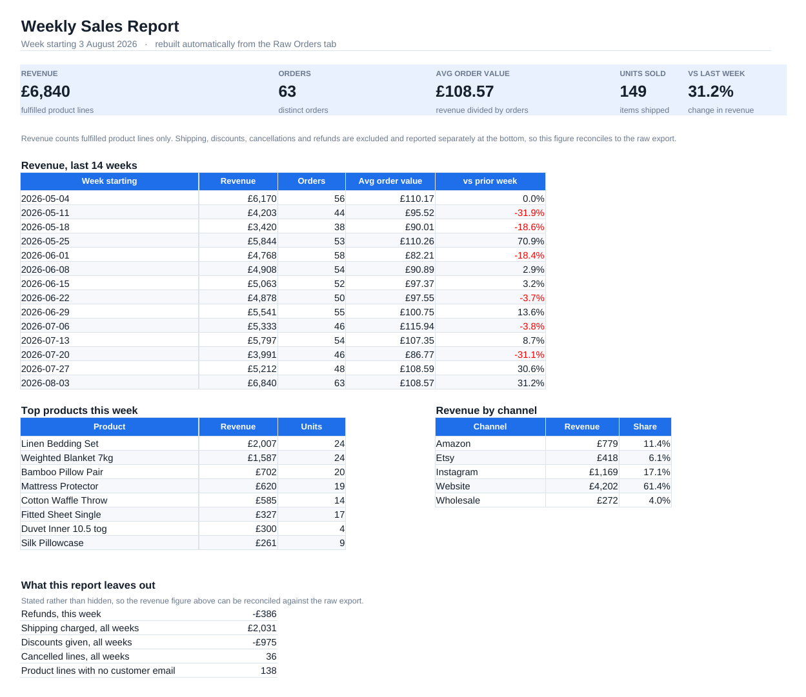
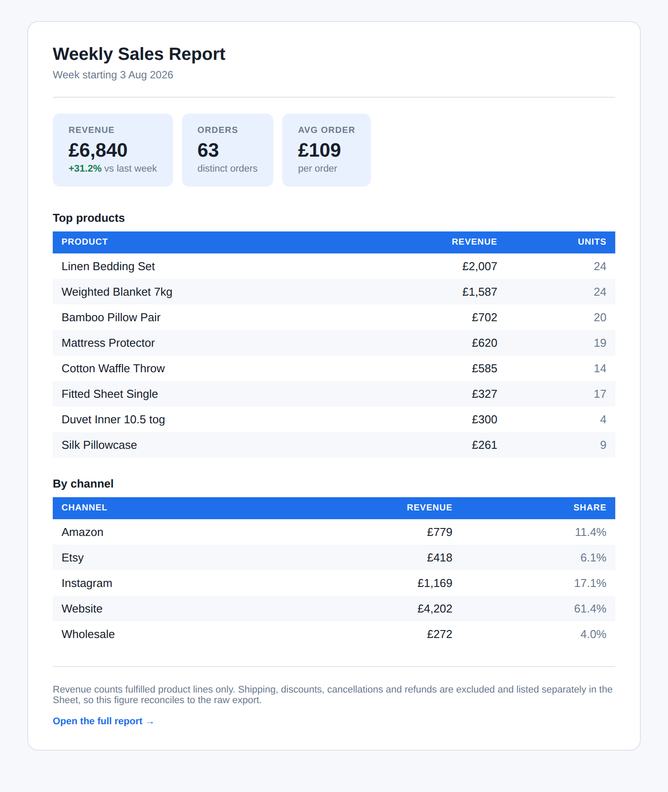
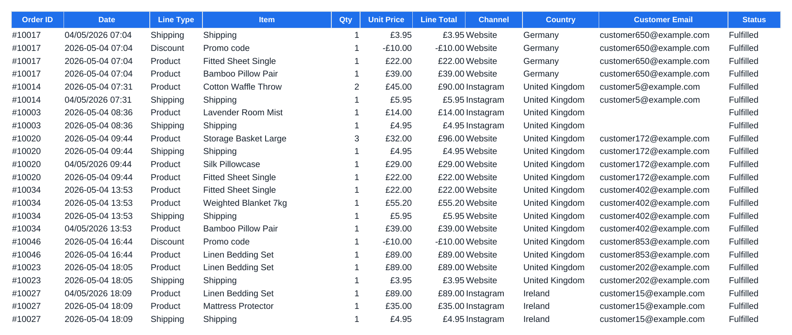

# Self-updating weekly sales report — Google Sheets + Apps Script

A small online store was rebuilding the same report every Monday by hand:
export orders, paste into a sheet, redo the pivots, retype the numbers into an
email. About ninety minutes a week, and the figures moved depending on who did
it.

This replaces that. Paste the export into one tab and the report rebuilds
itself. An Apps Script trigger then emails the summary on a schedule, so the
numbers arrive before anyone opens a laptop.



---

## What the client gets

**One Google Sheet, three tabs.**

| Tab | What it does |
|---|---|
| `Raw Orders` | Where the export is pasted. Never edited by hand. |
| `Weekly Calc` | The query layer: parses dates, classifies lines, aggregates by week. |
| `Weekly Report` | The one page anyone actually reads. |

**One Apps Script**, living in their own Google account, that emails this every
Monday morning:



Nothing calls an outside service. No subscription, no platform to log into, and
nothing that stops working if I disappear.

---

## What it started as

The export is not tidy. This is the top of it:



In 1,835 rows there are refunds, cancellations, shipping and discount lines
mixed in with sales, guest checkouts with no email, duplicated rows from a
double export, and dates written two different ways in the same column.

A report that ignores any of that is confidently wrong.

---

## The three decisions that make it trustworthy

**Revenue means one thing, and the report says what.** It counts fulfilled
product lines only. Shipping, discounts, cancellations and refunds are excluded
— and every one of them is printed at the bottom of the report with its value,
so the figure reconciles against the raw export instead of being taken on
trust.

**Dates are parsed without guessing.** The export writes both `2026-05-04 09:33`
and `04/05/2026 09:33`. `DATEVALUE` resolves the second one differently
depending on the reader's locale, and would silently swap day and month for
anyone outside the UK. The formula reads the separator instead and builds the
date explicitly, so it means the same thing everywhere:

```
=IF(MID(B2,5,1)="-",
    DATE(VALUE(LEFT(B2,4)),VALUE(MID(B2,6,2)),VALUE(MID(B2,9,2))),
    DATE(VALUE(MID(B2,7,4)),VALUE(MID(B2,4,2)),VALUE(LEFT(B2,2))))
```

**"Which week is this?" is one cell.** It resolves to the most recent week that
actually had orders, not the newest date in the file. A refund processed nine
days after the sale creates a week containing nothing but that refund, and
anchoring on the latest date would point the entire report at it.

---

## The script

`apps-script/Code.gs`. Four functions the client will ever touch:

| Function | What it does |
|---|---|
| `installWeeklyTrigger` | Sets the schedule. Removes its own previous trigger first, so running it twice never causes two emails. |
| `sendWeeklyReportNow` | Sends immediately, for checking it looks right. |
| `removeWeeklyTrigger` | Turns the schedule off without deleting anything. |
| `sendWeeklyReport` | What the trigger calls. |

Recipients, send day, send hour and the subject line are in a `CONFIG` block at
the top, so changing who receives it means editing one line — no hiring anyone.

**It refuses to send stale numbers.** If the newest order in the sheet is more
than ten days old, the script throws instead of sending. A failed export is
common; a scheduled job that cheerfully emails last month's revenue as if it
were this week's is much worse than one that visibly breaks.

It also calls `SpreadsheetApp.flush()` before reading. Sheets recalculates
lazily, and without it the script can read values from before the newest paste.

---

## Verification

`verify_workbook.py` recomputes all seventeen figures from the source CSV with
pandas and compares them against what the workbook actually evaluates to.

```
PASS  revenue, latest week          6840.05
PASS  orders, latest week           63
PASS  units, latest week            149
PASS  avg order value               108.57
PASS  week-over-week change         0.3123
PASS  total revenue, all weeks      71946.05
PASS  reporting week cell           2026-08-03
PASS  refunds, latest week          -386.0
PASS  shipping excluded             2031.45
PASS  discounts excluded            -975.0
PASS  cancelled lines               36
PASS  guest checkout lines          138
PASS  top product name              Linen Bedding Set
PASS  top product revenue           2006.95
PASS  second product name           Weighted Blanket 7kg
PASS  channel revenue totals match  6840.05
PASS  channel count                 5

All 17 checks passed. Every figure on the report reconciles to the raw export.
```

This matters more than it sounds. A spreadsheet with no `#REF!` errors is not a
correct spreadsheet — a range that is one row short still evaluates cleanly and
still gives the wrong total. Writing these checks caught four real bugs,
including numbers stored as text, which made every `SUMIFS` over the raw tab
return zero without complaining.

---

## Portability

Every formula uses functions that behave identically in Excel and Google
Sheets: `SUMIFS`, `INDEX`, `MATCH`, `LARGE`, `IFERROR`, `SUMPRODUCT`. No
`XLOOKUP`, `FILTER` or `UNIQUE`, because the file has to survive being uploaded
to Sheets and opened again in Excel.

---

## Running it yourself

```bash
pip install -r requirements.txt

python3 make_orders.py          # generate the demo export
python3 build_workbook.py       # build the three-tab workbook
python3 verify_workbook.py      # prove the numbers reconcile
```

Then upload `weekly-report-template.xlsx` to Google Drive, open it with Google
Sheets, and paste `apps-script/Code.gs` into Extensions ▸ Apps Script.

---

## Honest limits

- The demo data is generated, not a real store's export. The defects in it are
  real ones, but the numbers are synthetic.
- The "counts as an order" column uses an expanding `COUNTIF`, which is fine to
  around 20,000 rows and gets slow well beyond that. For a bigger file the
  aggregation belongs in the Apps Script rather than in formulas, and I would
  say so before starting rather than on day six.
- Gmail caps how many emails a script may send per day. Well outside the range
  of one weekly report, but worth knowing if the same script is pointed at a
  hundred recipients.

---

## Files

```
make_orders.py              generates a believable messy export
build_workbook.py           builds the three tabs and every formula
verify_workbook.py          17 checks, workbook against source
render_email_preview.py     renders the email exactly as the script sends it
apps-script/Code.gs         the scheduled rebuild and email
weekly-report-template.xlsx the deliverable
screenshots/
```

MIT licensed — see `LICENSE`.
